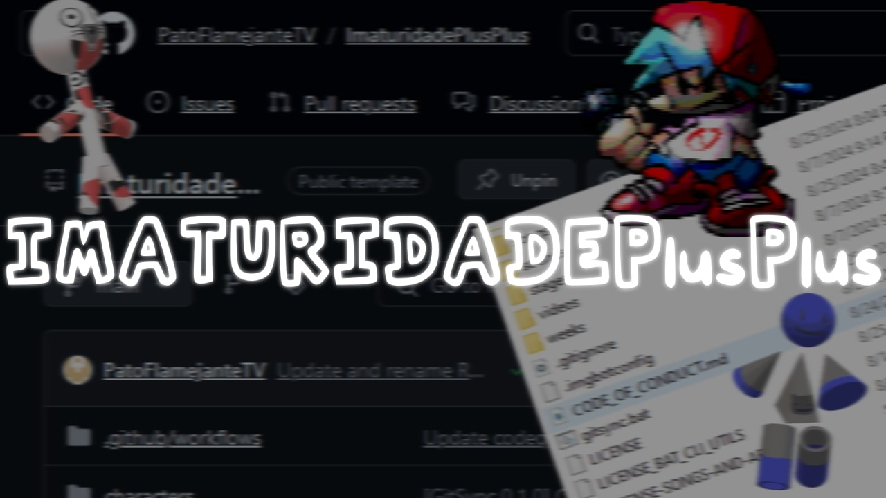

<p align="center">
  
</p>
<P align="center">
  
  
  
  
  
</P>
<P align="center">
  <small>Game Banana: https://gamebanana.com/mods/542102</small>
</P>


# Imaturidade++
> [!CAUTION]
> Caso você queira instalar a versão *(realmente)* mais recente do mod usando o método do `Code > Download as .ZIP`, ***LEMRE-SE DE RENOMEAR A PASTA PARA "`Imaturidade++`"***, se você não fizer isso, metade das mecânicas não iram funcionar 🥲<br>

Oi, esse mod é um **JOKE MOD**, UM **MOD DE [[ZUEIRA]]**, ele *não foi feito pra OFENDER **NINGUÉM**.*<br>

Ele contem algumas mecânicas *realmente* legais, como usar *(e abusar)* do `os.execute()` para fazer coisas legais durante as músicas, usar *Python* para usar *(e abusar)* da [*GDI* do *Windows*](https://learn.microsoft.com/en-us/windows/win32/gdi/windows-gdi), usa shaders em *C++* (eu acho) em algumas partes e ***muito mais! 😈***
## Funcionalidades
Diferente de *outros mods comuns*, esse faz coisas ***relativamente divertidas*** *(hihihi)*, como fazar coisas engraçadinhas no final de uma música, até mecher em coisas, com por exemplo:
* **[SPOILERS]**, algo ***BEEEEEM*** diferente
* **[SPOILERS]**, esse daqui foi bem legal de fazer ;)
* **[SPOILERS]**, maneirinho até
* e também **[SPOILERS]**! **ESSE FOI MUITO *BOOMMMMMMMMMMMMMMMMM***

## Requisitos
💻 = Só precisa caso quira jogar no Computador (isso engloba: *Windows, Linux, LapTop/Notebook, etc.*

🌐 = Precisa independente da plataforma, você pode estar no Android, IOS, Linux, Mac ou no Windows, você ***VAI*** precisar.

* 💻 Python
  
> (recomendado usar a versão mais recente, *mas acho que deve funcionar em versão **pré-históricas***)
* 🌐 Psych Engine
  
> ou qualquer Fork dela (*exemplo: JS Engine*)
* 💻 Arquivos ***.EXE, .DLL***
  
> Não roda em celular nem em Linux, então é desnecessário caso você não esteja jogando no WIndows (*exemplo: 7za.exe, 7za.dll*)
## Perguntas Frequentemente Perguntadas Com Frequência
### "Ei você usou [...] sem permissão
> Ei! você usou o [personagem/música/chart/imagem/sprite] do [mod/jogo] do meu [amigo/mod/grupo]!

Caso amigo <s>vsf</s> me manda um email e nois resolve <s>no soco</s> formalmente ;)

> Você não me deu os créditos no mod! Vai agorae creditaaaaaaaar!!!!!

Porra aí é foda, se você programou, animou, compôs algo, etc. pro mod e eu esqueci, me desculpa, agora eu não posso fazer nada caso voce só tenha testado a beta do mod KKKKKKKK.

### Tira [...] do seu mod agora!!
Não?
> Mas eu fiz a música que você colocou no seu mod.

Mande <s>nudes</s> provas ***concretas*** que você fez no meu email, eu irei ver o mais rápido possível.

> Mas o cara que fez disse que não pode-

Eu, apenas, removo, quando, o, criador, da, obra, original, me, contatar.
## Original README.txt
```
=====----- Imaturidade++/ImaturidadePlusPlus -----=====
Oi, esse mod é um JOKE MOD, UM MOD DE [[ZUEIRA]],
ele *não foi feito pra OFENDER NINGUÉM.*


A respeito da música LGBT, (quase) todos que participaram
da construção do mod são LGBTs (em geral).


Pretágio, CandyBro/CandyBoy, PBX/PedroBlox são OCs dos
membro do projeto. Todo o resto foi criado originalmente pro mod.


Bambi originalmente é de um mod chamado VS Dave and
Bambi, ele NÃO É ORIGINAL.


Setas, scripts, shaders dos mods: Silly Billy, VS FLOOR,
FNF RIVALS, Golden Apple PE Port.


Esse mod contém palavrões e luzes piscantes.


=====----- COMO JOGAR -----=====
## Requisitos:
- Psych Engine
- Metade de um Cérebro

## Não tá funcionando na minha versão:
Eu testei na psych 0.7.1, o mod usa alguns eventos/Scripts,
provavelmente deve funcionar mas versões 0.6.x.

## [[EU]] fiz um meme/música e gostaria que você
removesse ela do mod.
Converse [[FORMALMENTE]] e MOSTRE [[PROVAS]] no
meu email pessoal: patoflamejantetv@gmail.com

## Amei seu mod, eu quero botar mais músicas, fazer mais
coisa, te amar e ter três filhinhos: Julinho, Cleber e Jorge,
eu juro que vou pagar toda a pensão e nois vai ter uma
cachorro chamado paçoca e vamos viver felizes para
sempre.
Se você quer entrar na equipe do mod, me contate via
e-mail ou via Discord (@patoflamejantetv).

jq (jq.exe) is under MIT license.
7Zip CLI (7Za.exe) is under a bunch of licenses. (check https://github.com/PatoFlamejanteTV/ImaturidadePlusPlus/blob/main/7zip-License.txt for more details).
```
<p align="center">
    
    
    
    
    
    
    
    
    
    
    
</p>
